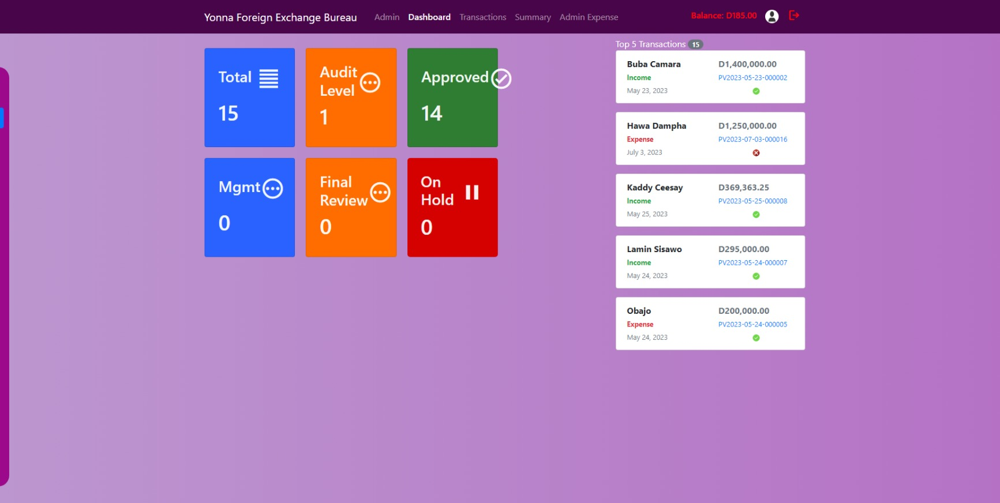

# Income Expense Tracker Project (Django)

## Table of Contents
- [Introduction](#introduction)
- [Features](#features)
- [Technologies Used](#technologies-used)
- [Installation](#installation)
- [Usage](#usage)
- [Contributing](#contributing)
- [License](#license)

## Introduction

The Income Expense Tracker is a web application built using Django, designed to help users manage their income and expenses effectively. This project aims to provide a simple and intuitive interface for users to track their financial transactions, categorize them, and generate useful reports to gain insights into their spending habits and financial health.

## Features

- User Registration and Authentication: Users can create accounts, log in securely, and manage their financial data privately.
- Income and Expense Management: Users can add, edit, and delete income and expense transactions, specifying the category, date, and other relevant details.
- Categorization: Transactions can be organized into custom categories to allow for better organization and analysis.
- Overview Dashboard: Users have access to a comprehensive dashboard that presents an overview of their income and expenses through charts and graphs.
- Monthly Reports: Generate detailed monthly reports to understand spending patterns and identify potential areas for saving.
- Search and Filter: Efficiently search and filter transactions based on date, category, and amount.
- Responsive Design: The application is designed to be mobile-friendly, ensuring access from various devices.

## Technologies Used

- Django: A powerful Python web framework for building robust web applications.
- HTML, CSS, JavaScript: Front-end technologies for creating a user-friendly interface.
- SQLite: A lightweight database used for data storage during development.
- Chart.js: A JavaScript library for creating interactive charts and graphs.

## Installation

1. Clone the repository: `git clone https://github.com/laminjawla1/income-expense.git`
2. Navigate to the project directory: `cd income-expense-tracker`
3. Create a virtual environment: `python -m venv venv`
4. Activate the virtual environment:
   - On Windows: `venv\Scripts\activate`
   - On macOS and Linux: `source venv/bin/activate`
5. Install the project dependencies: `pip install -r requirements.txt`
6. Run database migrations: `python manage.py migrate`
7. Create a superuser account: `python manage.py createsuperuser`
8. Start the development server: `python manage.py runserver`

## Usage

1. Access the application by visiting `http://localhost:8000/` in your web browser.
2. Register a new account or log in using existing credentials.
3. Add income and expense transactions, providing necessary details like category and date.
4. Explore the dashboard and generate monthly reports to analyze your financial data.

## Contributing

We welcome contributions to enhance the functionality and user experience of the Income Expense Tracker. If you find any issues or have new feature suggestions, please open an issue or submit a pull request. Your contributions are greatly appreciated!

## License

This project is licensed under the [MIT License](LICENSE). Feel free to use, modify, and distribute the code for personal and commercial purposes. Attribution is not required but appreciated.
